# 📊 Documentación Completa de Flujos del Sistema HostSigchos

> **Proyecto:** HostSigchos — Sistema de Reservas de Hosterías del Cantón Sigchos  
> **Institución:** Universidad de las Fuerzas Armadas ESPE  
> **Materia:** Aplicaciones Móviles — Sexto Semestre  
> **Fecha:** Julio 2026

---

## 📋 Tabla de Contenidos

1. [Diagrama de Arquitectura General del Sistema](#1-diagrama-de-arquitectura-general-del-sistema)
2. [Flujo de Arranque e Inicialización de la App](#2-flujo-de-arranque-e-inicialización-de-la-app)
3. [Flujo de Autenticación (Login / Registro / Google / Biometría)](#3-flujo-de-autenticación)
4. [Flujo de Verificación de Email](#4-flujo-de-verificación-de-email)
5. [Flujo de Recuperación de Contraseña](#5-flujo-de-recuperación-de-contraseña)
6. [Flujo de Navegación Principal de la App Móvil](#6-flujo-de-navegación-principal-de-la-app-móvil)
7. [Flujo de Exploración de Hosterías](#7-flujo-de-exploración-de-hosterías)
8. [Flujo de Consulta de Habitaciones y Disponibilidad](#8-flujo-de-consulta-de-habitaciones-y-disponibilidad)
9. [Flujo Completo de Reserva (Crear → Checkout → Confirmación)](#9-flujo-completo-de-reserva)
10. [Flujo del Carrito de Reservas](#10-flujo-del-carrito-de-reservas)
11. [Flujo de Ciclo de Vida de una Reserva (Estados)](#11-flujo-de-ciclo-de-vida-de-una-reserva-estados)
12. [Flujo de Cancelación de Reserva](#12-flujo-de-cancelación-de-reserva)
13. [Flujo de Notificaciones](#13-flujo-de-notificaciones)
14. [Flujo del Chatbot con IA (Texto y Audio)](#14-flujo-del-chatbot-con-ia)
15. [Flujo de Reseñas](#15-flujo-de-reseñas)
16. [Flujo de Geolocalización y Mapas](#16-flujo-de-geolocalización-y-mapas)
17. [Flujo de Gestión de Perfil](#17-flujo-de-gestión-de-perfil)
18. [Flujo del Panel Web — Propietario](#18-flujo-del-panel-web--propietario)
19. [Flujo del Panel Web — Administrador del Sistema](#19-flujo-del-panel-web--administrador-del-sistema)
20. [Flujo de Promociones y Descuentos](#20-flujo-de-promociones-y-descuentos)
21. [Diagrama de Modelo de Datos (Firestore)](#21-diagrama-de-modelo-de-datos-firestore)
22. [Flujo de Inyección de Dependencias (Clean Architecture)](#22-flujo-de-inyección-de-dependencias)
23. [Flujo de Internacionalización (i18n)](#23-flujo-de-internacionalización)
24. [Flujo de Seguridad (Firestore Rules)](#24-flujo-de-seguridad-firestore-rules)
25. [Diagrama de Despliegue](#25-diagrama-de-despliegue)

---

## 1. Diagrama de Arquitectura General del Sistema

Este diagrama muestra la visión macro de todo el ecosistema HostSigchos: la App Móvil Flutter, el Panel Web React, y los servicios de Firebase compartidos.

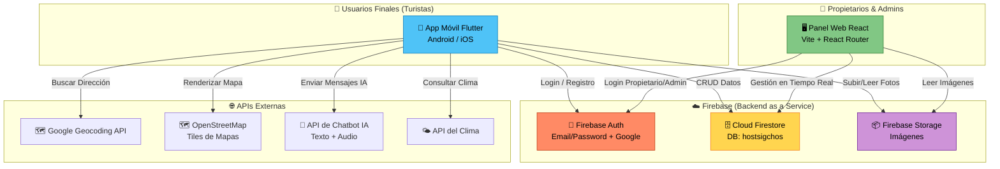
```mermaid
graph TB
    subgraph "👤 Usuarios Finales (Turistas)"
        MOVIL["📱 App Móvil Flutter<br/>Android / iOS"]
    end

    subgraph "🏨 Propietarios & Admins"
        WEB["🖥️ Panel Web React<br/>Vite + React Router"]
    end

    subgraph "☁️ Firebase (Backend as a Service)"
        AUTH["🔐 Firebase Auth<br/>Email/Password + Google"]
        FIRESTORE["🗄️ Cloud Firestore<br/>DB: hostsigchos"]
        STORAGE["📦 Firebase Storage<br/>Imágenes"]
    end

    subgraph "🌐 APIs Externas"
        GEOCODING["🗺️ Google Geocoding API"]
        OSM["🗺️ OpenStreetMap<br/>Tiles de Mapas"]
        CHATBOT_API["🤖 API de Chatbot IA<br/>Texto + Audio"]
        WEATHER["🌤️ API del Clima"]
    end

    MOVIL -->|"Login / Registro"| AUTH
    MOVIL -->|"CRUD Datos"| FIRESTORE
    MOVIL -->|"Subir/Leer Fotos"| STORAGE
    MOVIL -->|"Buscar Dirección"| GEOCODING
    MOVIL -->|"Renderizar Mapa"| OSM
    MOVIL -->|"Enviar Mensajes IA"| CHATBOT_API
    MOVIL -->|"Consultar Clima"| WEATHER

    WEB -->|"Login Propietario/Admin"| AUTH
    WEB -->|"Gestión en Tiempo Real"| FIRESTORE
    WEB -->|"Leer Imágenes"| STORAGE

    style MOVIL fill:#4FC3F7,stroke:#0277BD,color:#000
    style WEB fill:#81C784,stroke:#2E7D32,color:#000
    style AUTH fill:#FF8A65,stroke:#BF360C,color:#000
    style FIRESTORE fill:#FFD54F,stroke:#F57F17,color:#000
    style STORAGE fill:#CE93D8,stroke:#6A1B9A,color:#000
```

---

## 2. Flujo de Arranque e Inicialización de la App

Describe paso a paso qué ocurre desde que el usuario abre la app hasta que ve la primera pantalla funcional.

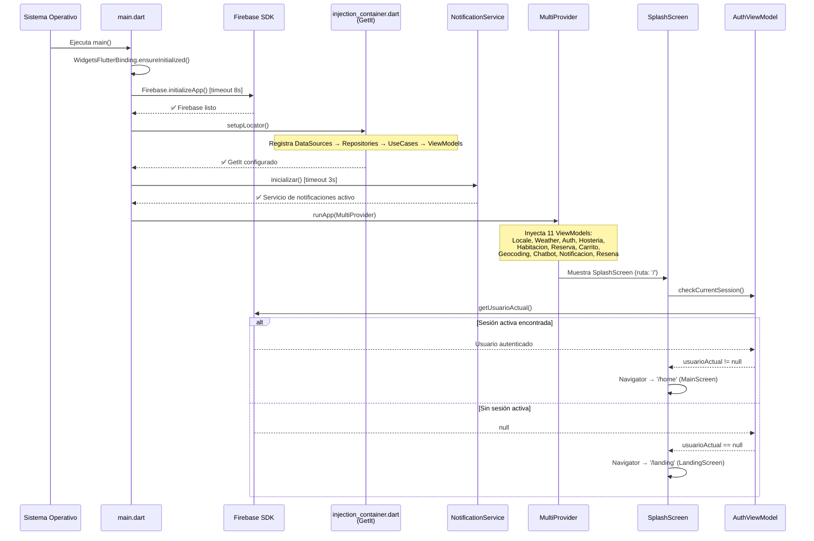
```mermaid
sequenceDiagram
    participant SO as Sistema Operativo
    participant Main as main.dart
    participant Firebase as Firebase SDK
    participant DI as injection_container.dart<br/>(GetIt)
    participant Notif as NotificationService
    participant MP as MultiProvider
    participant Splash as SplashScreen
    participant Auth as AuthViewModel

    SO->>Main: Ejecuta main()
    Main->>Main: WidgetsFlutterBinding.ensureInitialized()
    Main->>Firebase: Firebase.initializeApp() [timeout 8s]
    Firebase-->>Main: ✅ Firebase listo
    Main->>DI: setupLocator()
    Note over DI: Registra DataSources → Repositories → UseCases → ViewModels
    DI-->>Main: ✅ GetIt configurado
    Main->>Notif: inicializar() [timeout 3s]
    Notif-->>Main: ✅ Servicio de notificaciones activo
    Main->>MP: runApp(MultiProvider)
    Note over MP: Inyecta 11 ViewModels:<br/>Locale, Weather, Auth, Hosteria,<br/>Habitacion, Reserva, Carrito,<br/>Geocoding, Chatbot, Notificacion, Resena
    MP->>Splash: Muestra SplashScreen (ruta: '/')
    Splash->>Auth: checkCurrentSession()
    Auth->>Firebase: getUsuarioActual()
    alt Sesión activa encontrada
        Firebase-->>Auth: Usuario autenticado
        Auth-->>Splash: usuarioActual != null
        Splash->>Splash: Navigator → '/home' (MainScreen)
    else Sin sesión activa
        Firebase-->>Auth: null
        Auth-->>Splash: usuarioActual == null
        Splash->>Splash: Navigator → '/landing' (LandingScreen)
    end
```

---

## 3. Flujo de Autenticación

### 3.1 Login con Email y Contraseña

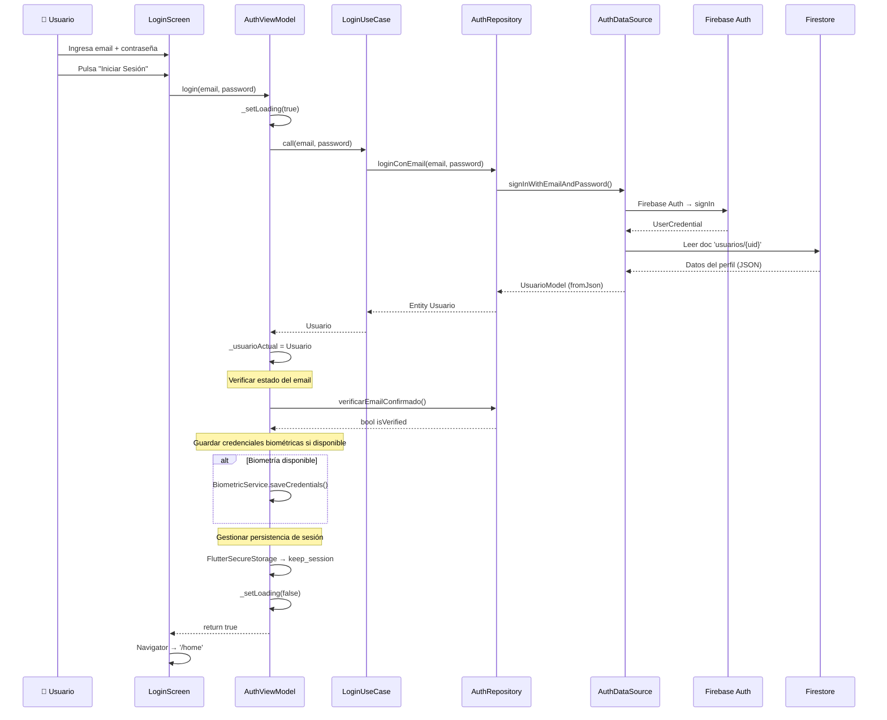
```mermaid
sequenceDiagram
    participant U as 👤 Usuario
    participant LS as LoginScreen
    participant AVM as AuthViewModel
    participant LUC as LoginUseCase
    participant AR as AuthRepository
    participant ADS as AuthDataSource
    participant FA as Firebase Auth
    participant FS as Firestore

    U->>LS: Ingresa email + contraseña
    U->>LS: Pulsa "Iniciar Sesión"
    LS->>AVM: login(email, password)
    AVM->>AVM: _setLoading(true)
    AVM->>LUC: call(email, password)
    LUC->>AR: loginConEmail(email, password)
    AR->>ADS: signInWithEmailAndPassword()
    ADS->>FA: Firebase Auth → signIn
    FA-->>ADS: UserCredential
    ADS->>FS: Leer doc 'usuarios/{uid}'
    FS-->>ADS: Datos del perfil (JSON)
    ADS-->>AR: UsuarioModel (fromJson)
    AR-->>LUC: Entity Usuario
    LUC-->>AVM: Usuario
    AVM->>AVM: _usuarioActual = Usuario

    Note over AVM: Verificar estado del email
    AVM->>AR: verificarEmailConfirmado()
    AR-->>AVM: bool isVerified

    Note over AVM: Guardar credenciales biométricas si disponible
    alt Biometría disponible
        AVM->>AVM: BiometricService.saveCredentials()
    end

    Note over AVM: Gestionar persistencia de sesión
    AVM->>AVM: FlutterSecureStorage → keep_session

    AVM->>AVM: _setLoading(false)
    AVM-->>LS: return true
    LS->>LS: Navigator → '/home'
```

### 3.2 Registro de Usuario Nuevo

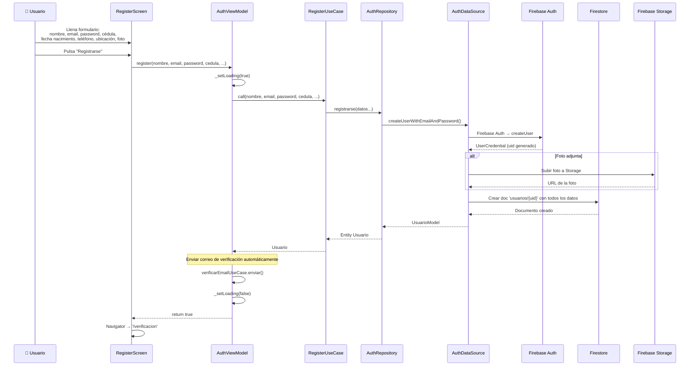
```mermaid
sequenceDiagram
    participant U as 👤 Usuario
    participant RS as RegisterScreen
    participant AVM as AuthViewModel
    participant RUC as RegisterUseCase
    participant AR as AuthRepository
    participant ADS as AuthDataSource
    participant FA as Firebase Auth
    participant FS as Firestore
    participant ST as Firebase Storage

    U->>RS: Llena formulario:<br/>nombre, email, password, cédula,<br/>fecha nacimiento, teléfono, ubicación, foto
    U->>RS: Pulsa "Registrarse"
    RS->>AVM: register(nombre, email, password, cedula, ...)
    AVM->>AVM: _setLoading(true)
    AVM->>RUC: call(nombre, email, password, cedula, ...)
    RUC->>AR: registrarse(datos...)
    AR->>ADS: createUserWithEmailAndPassword()
    ADS->>FA: Firebase Auth → createUser
    FA-->>ADS: UserCredential (uid generado)

    alt Foto adjunta
        ADS->>ST: Subir foto a Storage
        ST-->>ADS: URL de la foto
    end

    ADS->>FS: Crear doc 'usuarios/{uid}' con todos los datos
    FS-->>ADS: Documento creado
    ADS-->>AR: UsuarioModel
    AR-->>RUC: Entity Usuario
    RUC-->>AVM: Usuario

    Note over AVM: Enviar correo de verificación automáticamente
    AVM->>AVM: verificarEmailUseCase.enviar()
    AVM->>AVM: _setLoading(false)
    AVM-->>RS: return true
    RS->>RS: Navigator → '/verificacion'
```

### 3.3 Login con Google Sign-In

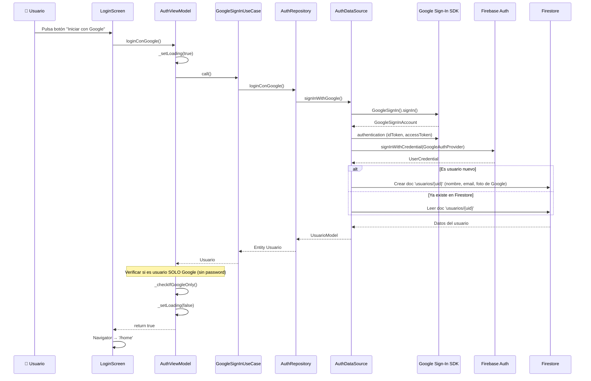
```mermaid
sequenceDiagram
    participant U as 👤 Usuario
    participant LS as LoginScreen
    participant AVM as AuthViewModel
    participant GUC as GoogleSignInUseCase
    participant AR as AuthRepository
    participant ADS as AuthDataSource
    participant GSDK as Google Sign-In SDK
    participant FA as Firebase Auth
    participant FS as Firestore

    U->>LS: Pulsa botón "Iniciar con Google"
    LS->>AVM: loginConGoogle()
    AVM->>AVM: _setLoading(true)
    AVM->>GUC: call()
    GUC->>AR: loginConGoogle()
    AR->>ADS: signInWithGoogle()
    ADS->>GSDK: GoogleSignIn().signIn()
    GSDK-->>ADS: GoogleSignInAccount
    ADS->>GSDK: authentication (idToken, accessToken)
    ADS->>FA: signInWithCredential(GoogleAuthProvider)
    FA-->>ADS: UserCredential

    alt Es usuario nuevo
        ADS->>FS: Crear doc 'usuarios/{uid}' (nombre, email, foto de Google)
    else Ya existe en Firestore
        ADS->>FS: Leer doc 'usuarios/{uid}'
    end
    FS-->>ADS: Datos del usuario
    ADS-->>AR: UsuarioModel
    AR-->>GUC: Entity Usuario
    GUC-->>AVM: Usuario

    Note over AVM: Verificar si es usuario SOLO Google (sin password)
    AVM->>AVM: _checkIfGoogleOnly()

    AVM->>AVM: _setLoading(false)
    AVM-->>LS: return true
    LS->>LS: Navigator → '/home'
```

### 3.4 Login con Biometría (Huella / Face ID)

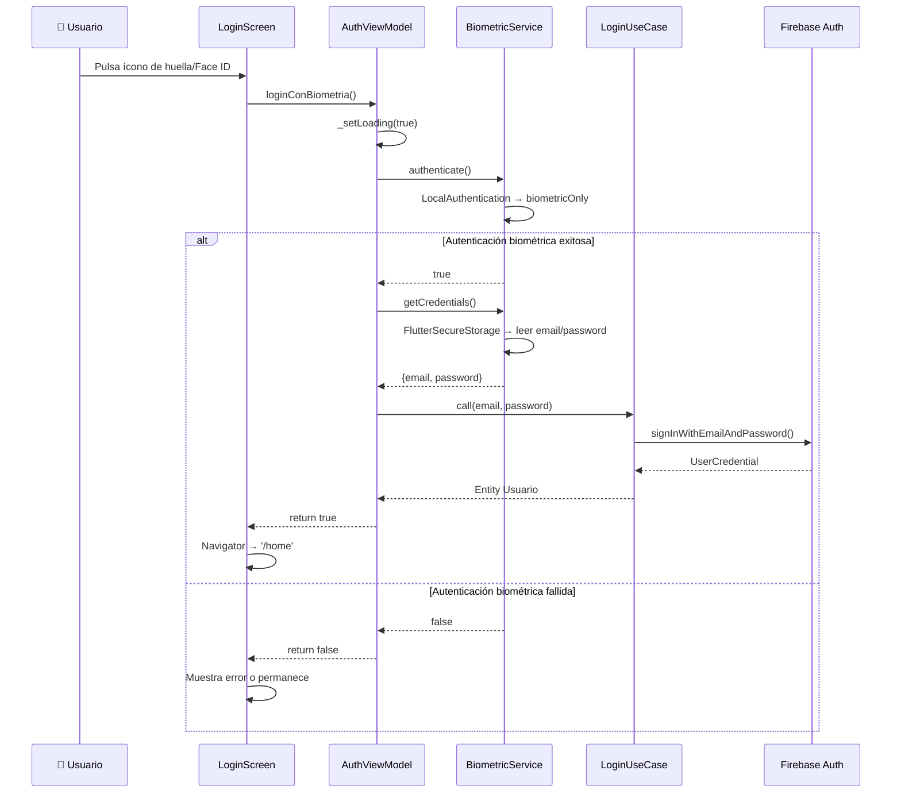
```mermaid
sequenceDiagram
    participant U as 👤 Usuario
    participant LS as LoginScreen
    participant AVM as AuthViewModel
    participant BIO as BiometricService
    participant LUC as LoginUseCase
    participant FA as Firebase Auth

    U->>LS: Pulsa ícono de huella/Face ID
    LS->>AVM: loginConBiometria()
    AVM->>AVM: _setLoading(true)
    AVM->>BIO: authenticate()
    BIO->>BIO: LocalAuthentication → biometricOnly
    alt Autenticación biométrica exitosa
        BIO-->>AVM: true
        AVM->>BIO: getCredentials()
        BIO->>BIO: FlutterSecureStorage → leer email/password
        BIO-->>AVM: {email, password}
        AVM->>LUC: call(email, password)
        LUC->>FA: signInWithEmailAndPassword()
        FA-->>LUC: UserCredential
        LUC-->>AVM: Entity Usuario
        AVM-->>LS: return true
        LS->>LS: Navigator → '/home'
    else Autenticación biométrica fallida
        BIO-->>AVM: false
        AVM-->>LS: return false
        LS->>LS: Muestra error o permanece
    end
```

---

## 4. Flujo de Verificación de Email

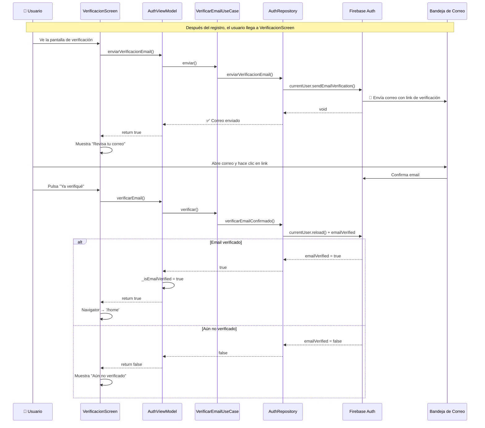
```mermaid
sequenceDiagram
    participant U as 👤 Usuario
    participant VS as VerificacionScreen
    participant AVM as AuthViewModel
    participant VUC as VerificarEmailUseCase
    participant AR as AuthRepository
    participant FA as Firebase Auth
    participant EMAIL as Bandeja de Correo

    Note over U,EMAIL: Después del registro, el usuario llega a VerificacionScreen

    U->>VS: Ve la pantalla de verificación
    VS->>AVM: enviarVerificacionEmail()
    AVM->>VUC: enviar()
    VUC->>AR: enviarVerificacionEmail()
    AR->>FA: currentUser.sendEmailVerification()
    FA->>EMAIL: 📧 Envía correo con link de verificación
    FA-->>AR: void
    AR-->>AVM: ✅ Correo enviado
    AVM-->>VS: return true
    VS->>VS: Muestra "Revisa tu correo"

    U->>EMAIL: Abre correo y hace clic en link
    EMAIL->>FA: Confirma email

    U->>VS: Pulsa "Ya verifiqué"
    VS->>AVM: verificarEmail()
    AVM->>VUC: verificar()
    VUC->>AR: verificarEmailConfirmado()
    AR->>FA: currentUser.reload() + emailVerified
    alt Email verificado
        FA-->>AR: emailVerified = true
        AR-->>AVM: true
        AVM->>AVM: _isEmailVerified = true
        AVM-->>VS: return true
        VS->>VS: Navigator → '/home'
    else Aún no verificado
        FA-->>AR: emailVerified = false
        AR-->>AVM: false
        AVM-->>VS: return false
        VS->>VS: Muestra "Aún no verificado"
    end
```

---

## 5. Flujo de Recuperación de Contraseña

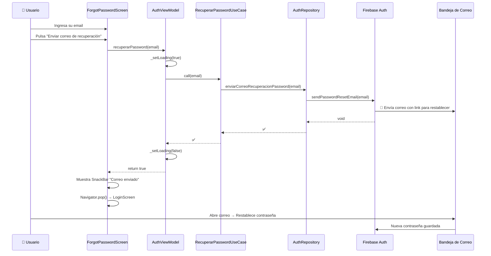
```mermaid
sequenceDiagram
    participant U as 👤 Usuario
    participant FPS as ForgotPasswordScreen
    participant AVM as AuthViewModel
    participant RUC as RecuperarPasswordUseCase
    participant AR as AuthRepository
    participant FA as Firebase Auth
    participant EMAIL as Bandeja de Correo

    U->>FPS: Ingresa su email
    U->>FPS: Pulsa "Enviar correo de recuperación"
    FPS->>AVM: recuperarPassword(email)
    AVM->>AVM: _setLoading(true)
    AVM->>RUC: call(email)
    RUC->>AR: enviarCorreoRecuperacionPassword(email)
    AR->>FA: sendPasswordResetEmail(email)
    FA->>EMAIL: 📧 Envía correo con link para restablecer
    FA-->>AR: void
    AR-->>RUC: ✅
    RUC-->>AVM: ✅
    AVM->>AVM: _setLoading(false)
    AVM-->>FPS: return true
    FPS->>FPS: Muestra SnackBar "Correo enviado"
    FPS->>FPS: Navigator.pop() → LoginScreen

    U->>EMAIL: Abre correo → Restablece contraseña
    EMAIL->>FA: Nueva contraseña guardada
```

---

## 6. Flujo de Navegación Principal de la App Móvil

Diagrama completo de todas las pantallas y cómo se conectan entre sí.

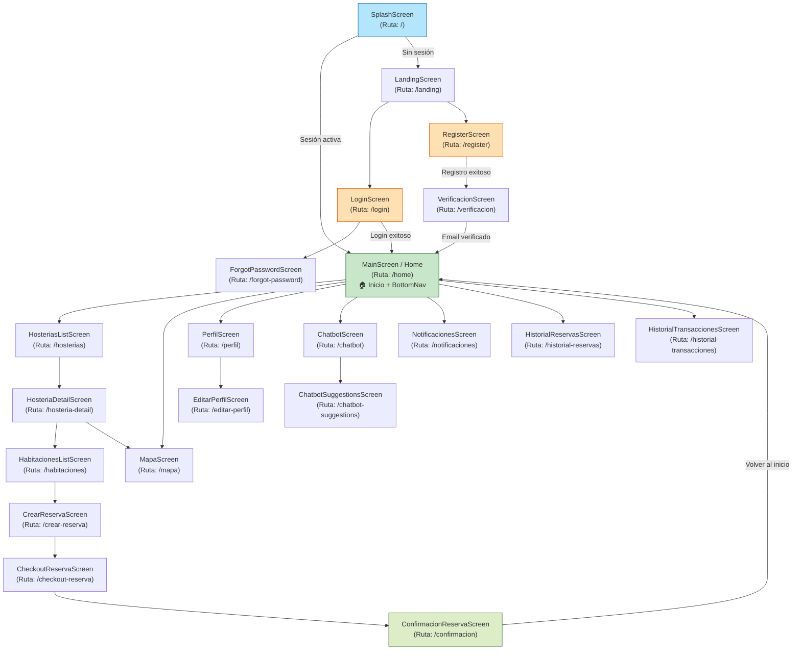
```mermaid
graph TD
    SPLASH["SplashScreen<br/>(Ruta: /)"]
    LANDING["LandingScreen<br/>(Ruta: /landing)"]
    LOGIN["LoginScreen<br/>(Ruta: /login)"]
    REGISTER["RegisterScreen<br/>(Ruta: /register)"]
    FORGOT["ForgotPasswordScreen<br/>(Ruta: /forgot-password)"]
    VERIF["VerificacionScreen<br/>(Ruta: /verificacion)"]

    HOME["MainScreen / Home<br/>(Ruta: /home)<br/>🏠 Inicio + BottomNav"]
    HLIST["HosteriasListScreen<br/>(Ruta: /hosterias)"]
    HDETAIL["HosteriaDetailScreen<br/>(Ruta: /hosteria-detail)"]
    HABLIST["HabitacionesListScreen<br/>(Ruta: /habitaciones)"]
    CREAR["CrearReservaScreen<br/>(Ruta: /crear-reserva)"]
    CHECKOUT["CheckoutReservaScreen<br/>(Ruta: /checkout-reserva)"]
    CONFIRM["ConfirmacionReservaScreen<br/>(Ruta: /confirmacion)"]
    HISTRES["HistorialReservasScreen<br/>(Ruta: /historial-reservas)"]
    HISTTRANS["HistorialTransaccionesScreen<br/>(Ruta: /historial-transacciones)"]

    MAPA["MapaScreen<br/>(Ruta: /mapa)"]
    PERFIL["PerfilScreen<br/>(Ruta: /perfil)"]
    EDITPERF["EditarPerfilScreen<br/>(Ruta: /editar-perfil)"]
    CHATBOT["ChatbotScreen<br/>(Ruta: /chatbot)"]
    CHATSUGG["ChatbotSuggestionsScreen<br/>(Ruta: /chatbot-suggestions)"]
    NOTIF["NotificacionesScreen<br/>(Ruta: /notificaciones)"]

    SPLASH -->|"Sesión activa"| HOME
    SPLASH -->|"Sin sesión"| LANDING
    LANDING --> LOGIN
    LANDING --> REGISTER
    LOGIN --> FORGOT
    LOGIN -->|"Login exitoso"| HOME
    REGISTER -->|"Registro exitoso"| VERIF
    VERIF -->|"Email verificado"| HOME

    HOME --> HLIST
    HOME --> MAPA
    HOME --> PERFIL
    HOME --> CHATBOT
    HOME --> NOTIF
    HOME --> HISTRES
    HOME --> HISTTRANS

    HLIST --> HDETAIL
    HDETAIL --> HABLIST
    HDETAIL --> MAPA
    HABLIST --> CREAR
    CREAR --> CHECKOUT
    CHECKOUT --> CONFIRM
    CONFIRM -->|"Volver al inicio"| HOME

    PERFIL --> EDITPERF
    CHATBOT --> CHATSUGG

    style SPLASH fill:#B3E5FC,stroke:#01579B
    style HOME fill:#C8E6C9,stroke:#1B5E20
    style CONFIRM fill:#DCEDC8,stroke:#33691E
    style LOGIN fill:#FFE0B2,stroke:#E65100
    style REGISTER fill:#FFE0B2,stroke:#E65100
```

---

## 7. Flujo de Exploración de Hosterías

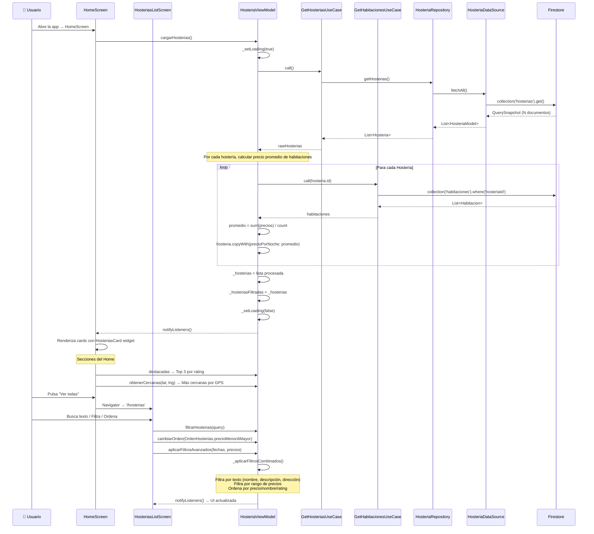
```mermaid
sequenceDiagram
    participant U as 👤 Usuario
    participant HS as HomeScreen
    participant HLS as HosteriasListScreen
    participant HVM as HosteriaViewModel
    participant GHU as GetHosteriasUseCase
    participant GHA as GetHabitacionesUseCase
    participant HR as HosteriaRepository
    participant HDS as HosteriaDataSource
    participant FS as Firestore

    U->>HS: Abre la app → HomeScreen
    HS->>HVM: cargarHosterias()
    HVM->>HVM: _setLoading(true)
    HVM->>GHU: call()
    GHU->>HR: getHosterias()
    HR->>HDS: fetchAll()
    HDS->>FS: collection('hosterias').get()
    FS-->>HDS: QuerySnapshot (N documentos)
    HDS-->>HR: List<HosteriaModel>
    HR-->>GHU: List<Hosteria>
    GHU-->>HVM: rawHosterias

    Note over HVM: Por cada hostería, calcular precio promedio de habitaciones
    loop Para cada Hostería
        HVM->>GHA: call(hosteria.id)
        GHA->>FS: collection('habitaciones').where('hosteriaId')
        FS-->>GHA: List<Habitacion>
        GHA-->>HVM: habitaciones
        HVM->>HVM: promedio = sum(precios) / count
        HVM->>HVM: hosteria.copyWith(precioPorNoche: promedio)
    end

    HVM->>HVM: _hosterias = lista procesada
    HVM->>HVM: _hosteriasFiltradas = _hosterias
    HVM->>HVM: _setLoading(false)
    HVM-->>HS: notifyListeners()
    HS->>HS: Renderiza cards con HosteriasCard widget

    Note over HS: Secciones del Home
    HS->>HVM: destacadas → Top 3 por rating
    HS->>HVM: obtenerCercanas(lat, lng) → Más cercanas por GPS

    U->>HS: Pulsa "Ver todas"
    HS->>HLS: Navigator → '/hosterias'

    U->>HLS: Busca texto / Filtra / Ordena
    HLS->>HVM: filtrarHosterias(query)
    HLS->>HVM: cambiarOrden(OrdenHosterias.precioMenorAMayor)
    HLS->>HVM: aplicarFiltrosAvanzados(fechas, precios)
    HVM->>HVM: _aplicarFiltrosCombinados()
    Note over HVM: Filtra por texto (nombre, descripción, dirección)<br/>Filtra por rango de precios<br/>Ordena por precio/nombre/rating
    HVM-->>HLS: notifyListeners() → UI actualizada
```

---

## 8. Flujo de Consulta de Habitaciones y Disponibilidad

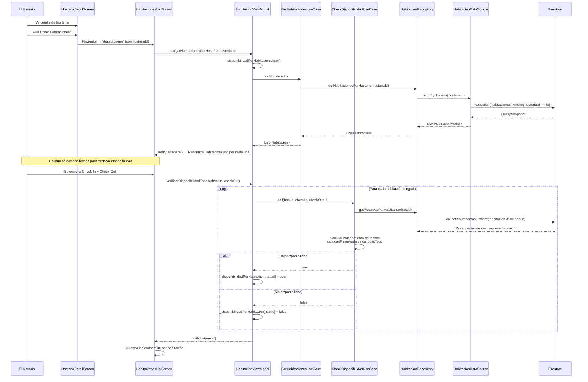
```mermaid
sequenceDiagram
    participant U as 👤 Usuario
    participant HDS as HosteriaDetailScreen
    participant HLS as HabitacionesListScreen
    participant HAVM as HabitacionViewModel
    participant GHUC as GetHabitacionesUseCase
    participant CDUC as CheckDisponibilidadUseCase
    participant HABR as HabitacionRepository
    participant HABDS as HabitacionDataSource
    participant FS as Firestore

    U->>HDS: Ve detalle de hostería
    U->>HDS: Pulsa "Ver Habitaciones"
    HDS->>HLS: Navigator → '/habitaciones' (con hosteriaId)

    HLS->>HAVM: cargarHabitacionesPorHosteria(hosteriaId)
    HAVM->>HAVM: _disponibilidadPorHabitacion.clear()
    HAVM->>GHUC: call(hosteriaId)
    GHUC->>HABR: getHabitacionesPorHosteria(hosteriaId)
    HABR->>HABDS: fetchByHosteria(hosteriaId)
    HABDS->>FS: collection('habitaciones').where('hosteriaId' == id)
    FS-->>HABDS: QuerySnapshot
    HABDS-->>HABR: List<HabitacionModel>
    HABR-->>GHUC: List<Habitacion>
    GHUC-->>HAVM: List<Habitacion>
    HAVM-->>HLS: notifyListeners() → Renderiza HabitacionCard por cada una

    Note over U,HLS: Usuario selecciona fechas para verificar disponibilidad

    U->>HLS: Selecciona Check-In y Check-Out
    HLS->>HAVM: verificarDisponibilidadTodas(checkIn, checkOut)

    loop Para cada habitación cargada
        HAVM->>CDUC: call(hab.id, checkIn, checkOut, 1)
        CDUC->>HABR: getReservasPorHabitacion(hab.id)
        HABR->>FS: collection('reservas').where('habitacionId' == hab.id)
        FS-->>HABR: Reservas existentes para esa habitación
        CDUC->>CDUC: Calcular solapamiento de fechas<br/>cantidadReservada vs cantidadTotal
        alt Hay disponibilidad
            CDUC-->>HAVM: true
            HAVM->>HAVM: _disponibilidadPorHabitacion[hab.id] = true
        else Sin disponibilidad
            CDUC-->>HAVM: false
            HAVM->>HAVM: _disponibilidadPorHabitacion[hab.id] = false
        end
    end

    HAVM-->>HLS: notifyListeners()
    HLS->>HLS: Muestra indicador ✅/❌ por habitación
```

---

## 9. Flujo Completo de Reserva

### 9.1 Crear Reserva → Checkout → Confirmación

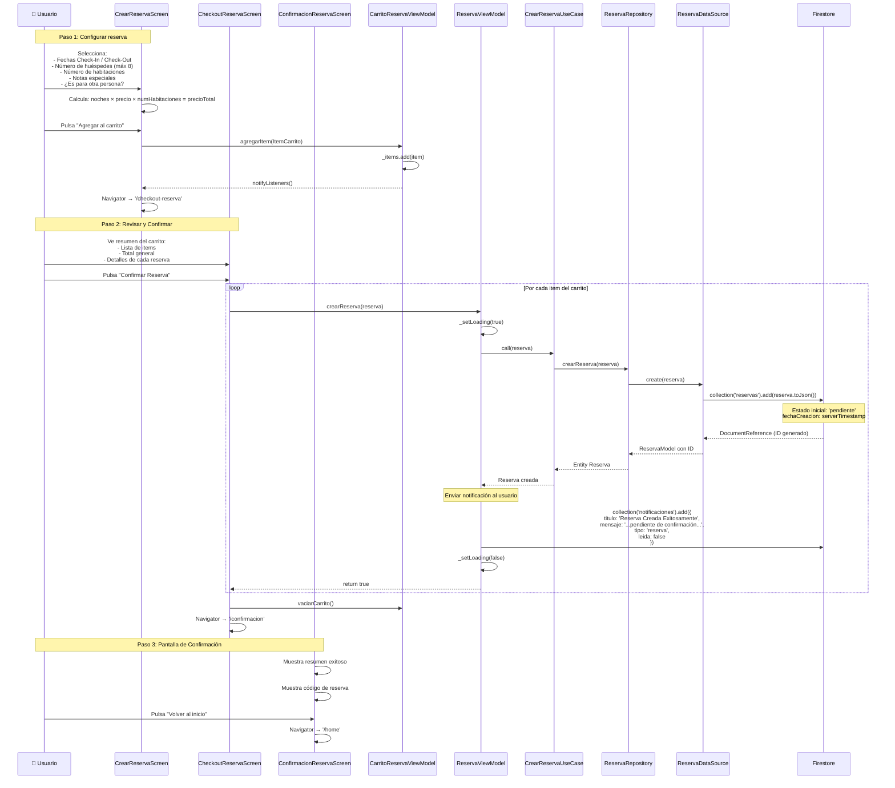
```mermaid
sequenceDiagram
    participant U as 👤 Usuario
    participant CRS as CrearReservaScreen
    participant COS as CheckoutReservaScreen
    participant CONS as ConfirmacionReservaScreen
    participant CVM as CarritoReservaViewModel
    participant RVM as ReservaViewModel
    participant CRUC as CrearReservaUseCase
    participant RR as ReservaRepository
    participant RDS as ReservaDataSource
    participant FS as Firestore

    Note over U,CRS: Paso 1: Configurar reserva
    U->>CRS: Selecciona:<br/>- Fechas Check-In / Check-Out<br/>- Número de huéspedes (máx 8)<br/>- Número de habitaciones<br/>- Notas especiales<br/>- ¿Es para otra persona?
    CRS->>CRS: Calcula: noches × precio × numHabitaciones = precioTotal
    U->>CRS: Pulsa "Agregar al carrito"
    CRS->>CVM: agregarItem(ItemCarrito)
    CVM->>CVM: _items.add(item)
    CVM-->>CRS: notifyListeners()
    CRS->>CRS: Navigator → '/checkout-reserva'

    Note over U,COS: Paso 2: Revisar y Confirmar
    U->>COS: Ve resumen del carrito:<br/>- Lista de items<br/>- Total general<br/>- Detalles de cada reserva
    U->>COS: Pulsa "Confirmar Reserva"

    loop Por cada item del carrito
        COS->>RVM: crearReserva(reserva)
        RVM->>RVM: _setLoading(true)
        RVM->>CRUC: call(reserva)
        CRUC->>RR: crearReserva(reserva)
        RR->>RDS: create(reserva)
        RDS->>FS: collection('reservas').add(reserva.toJson())
        Note over FS: Estado inicial: 'pendiente'<br/>fechaCreacion: serverTimestamp
        FS-->>RDS: DocumentReference (ID generado)
        RDS-->>RR: ReservaModel con ID
        RR-->>CRUC: Entity Reserva
        CRUC-->>RVM: Reserva creada

        Note over RVM: Enviar notificación al usuario
        RVM->>FS: collection('notificaciones').add({<br/>  titulo: 'Reserva Creada Exitosamente',<br/>  mensaje: '...pendiente de confirmación...',<br/>  tipo: 'reserva',<br/>  leida: false<br/>})
        RVM->>RVM: _setLoading(false)
        RVM-->>COS: return true
    end

    COS->>CVM: vaciarCarrito()
    COS->>COS: Navigator → '/confirmacion'

    Note over U,CONS: Paso 3: Pantalla de Confirmación
    CONS->>CONS: Muestra resumen exitoso
    CONS->>CONS: Muestra código de reserva
    U->>CONS: Pulsa "Volver al inicio"
    CONS->>CONS: Navigator → '/home'
```

### 9.2 Diagrama de Flujo Visual del Proceso de Reserva

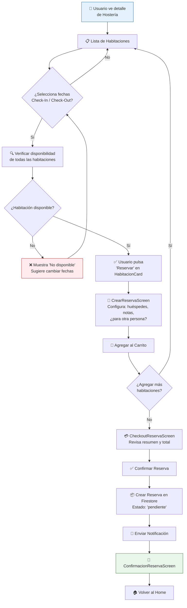
```mermaid
flowchart TD
    A["🏨 Usuario ve detalle<br/>de Hostería"] --> B["📋 Lista de Habitaciones"]
    B --> C{"¿Selecciona fechas<br/>Check-In / Check-Out?"}
    C -->|Sí| D["🔍 Verificar disponibilidad<br/>de todas las habitaciones"]
    C -->|No| B
    D --> E{"¿Habitación disponible?"}
    E -->|No| F["❌ Muestra 'No disponible'<br/>Sugiere cambiar fechas"]
    F --> C
    E -->|Sí| G["✅ Usuario pulsa<br/>'Reservar' en HabitacionCard"]
    G --> H["📝 CrearReservaScreen<br/>Configura: huéspedes, notas,<br/>¿para otra persona?"]
    H --> I["🛒 Agregar al Carrito"]
    I --> J{"¿Agregar más<br/>habitaciones?"}
    J -->|Sí| B
    J -->|No| K["💳 CheckoutReservaScreen<br/>Revisa resumen y total"]
    K --> L["✅ Confirmar Reserva"]
    L --> M["📦 Crear Reserva en Firestore<br/>Estado: 'pendiente'"]
    M --> N["🔔 Enviar Notificación"]
    N --> O["🎉 ConfirmacionReservaScreen"]
    O --> P["🏠 Volver al Home"]

    style A fill:#E3F2FD,stroke:#1565C0
    style O fill:#E8F5E9,stroke:#2E7D32
    style F fill:#FFEBEE,stroke:#C62828
```

---

## 10. Flujo del Carrito de Reservas

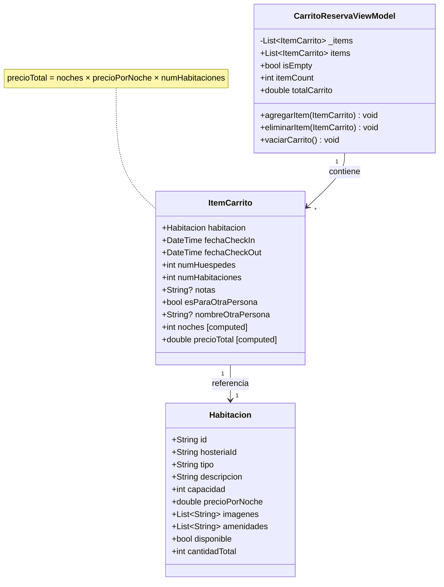
```mermaid
classDiagram
    class CarritoReservaViewModel {
        -List~ItemCarrito~ _items
        +List~ItemCarrito~ items
        +bool isEmpty
        +int itemCount
        +double totalCarrito
        +agregarItem(ItemCarrito) void
        +eliminarItem(ItemCarrito) void
        +vaciarCarrito() void
    }

    class ItemCarrito {
        +Habitacion habitacion
        +DateTime fechaCheckIn
        +DateTime fechaCheckOut
        +int numHuespedes
        +int numHabitaciones
        +String? notas
        +bool esParaOtraPersona
        +String? nombreOtraPersona
        +int noches [computed]
        +double precioTotal [computed]
    }

    class Habitacion {
        +String id
        +String hosteriaId
        +String tipo
        +String descripcion
        +int capacidad
        +double precioPorNoche
        +List~String~ imagenes
        +List~String~ amenidades
        +bool disponible
        +int cantidadTotal
    }

    CarritoReservaViewModel "1" --> "*" ItemCarrito : contiene
    ItemCarrito "1" --> "1" Habitacion : referencia

    note for ItemCarrito "precioTotal = noches × precioPorNoche × numHabitaciones"
```

---

## 11. Flujo de Ciclo de Vida de una Reserva (Estados)

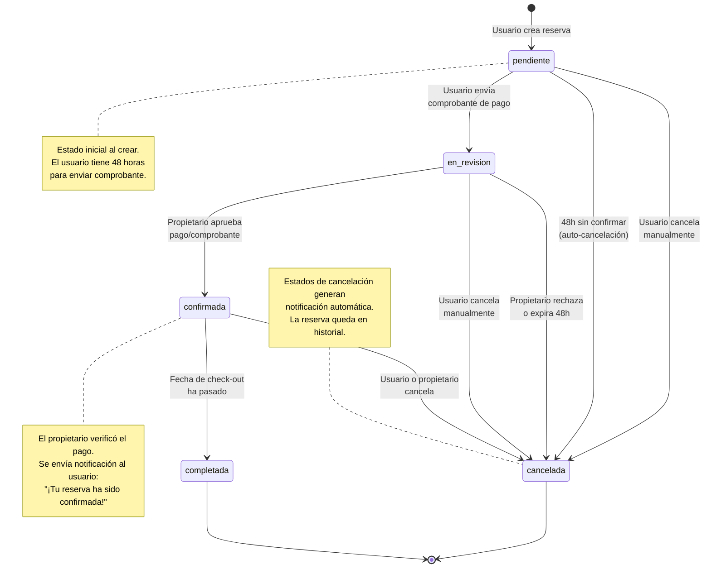
```mermaid
stateDiagram-v2
    [*] --> pendiente : Usuario crea reserva

    pendiente --> en_revision : Usuario envía<br/>comprobante de pago
    pendiente --> cancelada : Usuario cancela<br/>manualmente
    pendiente --> cancelada : 48h sin confirmar<br/>(auto-cancelación)

    en_revision --> confirmada : Propietario aprueba<br/>pago/comprobante
    en_revision --> cancelada : Propietario rechaza<br/>o expira 48h
    en_revision --> cancelada : Usuario cancela<br/>manualmente

    confirmada --> completada : Fecha de check-out<br/>ha pasado
    confirmada --> cancelada : Usuario o propietario<br/>cancela

    cancelada --> [*]
    completada --> [*]

    note right of pendiente
        Estado inicial al crear.
        El usuario tiene 48 horas
        para enviar comprobante.
    end note

    note right of confirmada
        El propietario verificó el pago.
        Se envía notificación al usuario:
        "¡Tu reserva ha sido confirmada!"
    end note

    note left of cancelada
        Estados de cancelación generan
        notificación automática.
        La reserva queda en historial.
    end note
```

---

## 12. Flujo de Cancelación de Reserva

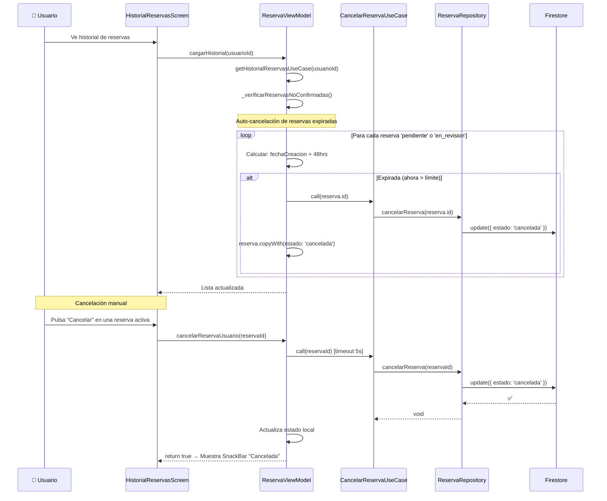
```mermaid
sequenceDiagram
    participant U as 👤 Usuario
    participant HRS as HistorialReservasScreen
    participant RVM as ReservaViewModel
    participant CRUC as CancelarReservaUseCase
    participant RR as ReservaRepository
    participant FS as Firestore

    U->>HRS: Ve historial de reservas
    HRS->>RVM: cargarHistorial(usuarioId)
    RVM->>RVM: getHistorialReservasUseCase(usuarioId)
    RVM->>RVM: _verificarReservasNoConfirmadas()

    Note over RVM: Auto-cancelación de reservas expiradas
    loop Para cada reserva 'pendiente' o 'en_revision'
        RVM->>RVM: Calcular: fechaCreacion + 48hrs
        alt Expirada (ahora > límite)
            RVM->>CRUC: call(reserva.id)
            CRUC->>RR: cancelarReserva(reserva.id)
            RR->>FS: update({ estado: 'cancelada' })
            RVM->>RVM: reserva.copyWith(estado: 'cancelada')
        end
    end
    RVM-->>HRS: Lista actualizada

    Note over U,HRS: Cancelación manual
    U->>HRS: Pulsa "Cancelar" en una reserva activa
    HRS->>RVM: cancelarReservaUsuario(reservaId)
    RVM->>CRUC: call(reservaId) [timeout 5s]
    CRUC->>RR: cancelarReserva(reservaId)
    RR->>FS: update({ estado: 'cancelada' })
    FS-->>RR: ✅
    RR-->>CRUC: void
    RVM->>RVM: Actualiza estado local
    RVM-->>HRS: return true → Muestra SnackBar "Cancelada"
```

---

## 13. Flujo de Notificaciones

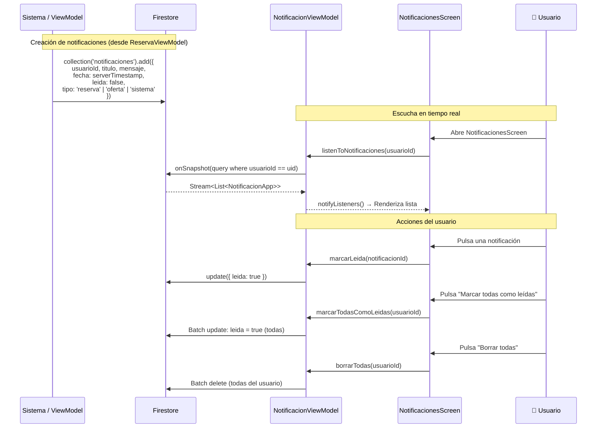
```mermaid
sequenceDiagram
    participant SISTEMA as Sistema / ViewModel
    participant FS as Firestore
    participant NVM as NotificacionViewModel
    participant NS as NotificacionesScreen
    participant U as 👤 Usuario

    Note over SISTEMA,FS: Creación de notificaciones (desde ReservaViewModel)
    SISTEMA->>FS: collection('notificaciones').add({<br/>  usuarioId, titulo, mensaje,<br/>  fecha: serverTimestamp,<br/>  leida: false,<br/>  tipo: 'reserva' | 'oferta' | 'sistema'<br/>})

    Note over NVM,U: Escucha en tiempo real
    U->>NS: Abre NotificacionesScreen
    NS->>NVM: listenToNotificaciones(usuarioId)
    NVM->>FS: onSnapshot(query where usuarioId == uid)
    FS-->>NVM: Stream<List<NotificacionApp>>
    NVM-->>NS: notifyListeners() → Renderiza lista

    Note over U,NVM: Acciones del usuario
    U->>NS: Pulsa una notificación
    NS->>NVM: marcarLeida(notificacionId)
    NVM->>FS: update({ leida: true })

    U->>NS: Pulsa "Marcar todas como leídas"
    NS->>NVM: marcarTodasComoLeidas(usuarioId)
    NVM->>FS: Batch update: leida = true (todas)

    U->>NS: Pulsa "Borrar todas"
    NS->>NVM: borrarTodas(usuarioId)
    NVM->>FS: Batch delete (todas del usuario)
```

### Tipos de Notificaciones Generadas

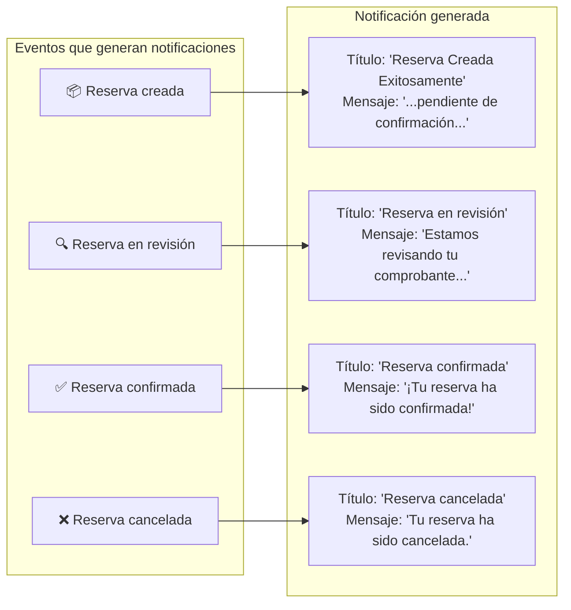
```mermaid
flowchart LR
    subgraph "Eventos que generan notificaciones"
        E1["📦 Reserva creada"]
        E2["🔍 Reserva en revisión"]
        E3["✅ Reserva confirmada"]
        E4["❌ Reserva cancelada"]
    end

    subgraph "Notificación generada"
        N1["Título: 'Reserva Creada Exitosamente'<br/>Mensaje: '...pendiente de confirmación...'"]
        N2["Título: 'Reserva en revisión'<br/>Mensaje: 'Estamos revisando tu comprobante...'"]
        N3["Título: 'Reserva confirmada'<br/>Mensaje: '¡Tu reserva ha sido confirmada!'"]
        N4["Título: 'Reserva cancelada'<br/>Mensaje: 'Tu reserva ha sido cancelada.'"]
    end

    E1 --> N1
    E2 --> N2
    E3 --> N3
    E4 --> N4
```

---

## 14. Flujo del Chatbot con IA

### 14.1 Envío de Mensaje de Texto

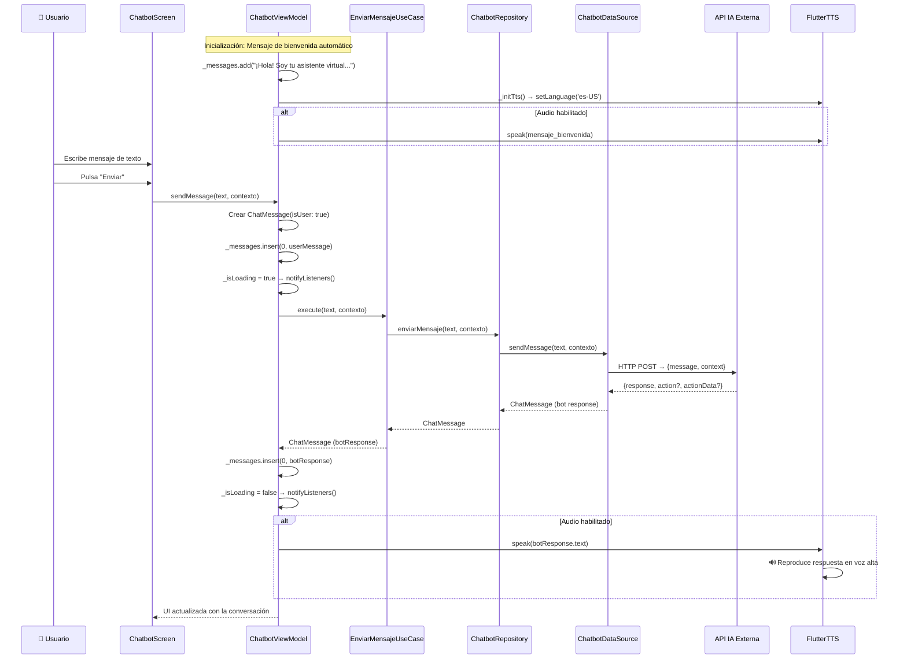
```mermaid
sequenceDiagram
    participant U as 👤 Usuario
    participant CS as ChatbotScreen
    participant CVM as ChatbotViewModel
    participant EMUC as EnviarMensajeUseCase
    participant CR as ChatbotRepository
    participant CDS as ChatbotDataSource
    participant API as API IA Externa
    participant TTS as FlutterTTS

    Note over CVM: Inicialización: Mensaje de bienvenida automático
    CVM->>CVM: _messages.add("¡Hola! Soy tu asistente virtual...")
    CVM->>TTS: _initTts() → setLanguage('es-US')
    alt Audio habilitado
        CVM->>TTS: speak(mensaje_bienvenida)
    end

    U->>CS: Escribe mensaje de texto
    U->>CS: Pulsa "Enviar"
    CS->>CVM: sendMessage(text, contexto)

    CVM->>CVM: Crear ChatMessage(isUser: true)
    CVM->>CVM: _messages.insert(0, userMessage)
    CVM->>CVM: _isLoading = true → notifyListeners()

    CVM->>EMUC: execute(text, contexto)
    EMUC->>CR: enviarMensaje(text, contexto)
    CR->>CDS: sendMessage(text, contexto)
    CDS->>API: HTTP POST → {message, context}
    API-->>CDS: {response, action?, actionData?}
    CDS-->>CR: ChatMessage (bot response)
    CR-->>EMUC: ChatMessage
    EMUC-->>CVM: ChatMessage (botResponse)

    CVM->>CVM: _messages.insert(0, botResponse)
    CVM->>CVM: _isLoading = false → notifyListeners()

    alt Audio habilitado
        CVM->>TTS: speak(botResponse.text)
        TTS->>TTS: 🔊 Reproduce respuesta en voz alta
    end

    CVM-->>CS: UI actualizada con la conversación
```

### 14.2 Envío de Mensaje de Audio

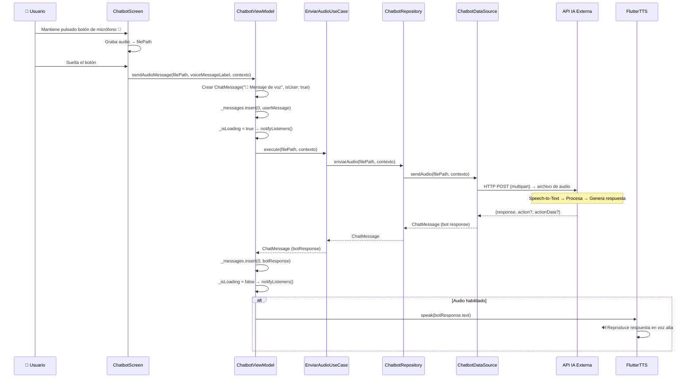
```mermaid
sequenceDiagram
    participant U as 👤 Usuario
    participant CS as ChatbotScreen
    participant CVM as ChatbotViewModel
    participant EAUC as EnviarAudioUseCase
    participant CR as ChatbotRepository
    participant CDS as ChatbotDataSource
    participant API as API IA Externa
    participant TTS as FlutterTTS

    U->>CS: Mantiene pulsado botón de micrófono 🎤
    CS->>CS: Graba audio → filePath
    U->>CS: Suelta el botón
    CS->>CVM: sendAudioMessage(filePath, voiceMessageLabel, contexto)

    CVM->>CVM: Crear ChatMessage("🎤 Mensaje de voz", isUser: true)
    CVM->>CVM: _messages.insert(0, userMessage)
    CVM->>CVM: _isLoading = true → notifyListeners()

    CVM->>EAUC: execute(filePath, contexto)
    EAUC->>CR: enviarAudio(filePath, contexto)
    CR->>CDS: sendAudio(filePath, contexto)
    CDS->>API: HTTP POST (multipart) → archivo de audio
    Note over API: Speech-to-Text → Procesa → Genera respuesta
    API-->>CDS: {response, action?, actionData?}
    CDS-->>CR: ChatMessage (bot response)
    CR-->>EAUC: ChatMessage
    EAUC-->>CVM: ChatMessage (botResponse)

    CVM->>CVM: _messages.insert(0, botResponse)
    CVM->>CVM: _isLoading = false → notifyListeners()

    alt Audio habilitado
        CVM->>TTS: speak(botResponse.text)
        TTS->>TTS: 🔊 Reproduce respuesta en voz alta
    end
```

---

## 15. Flujo de Reseñas

```mermaid
sequenceDiagram
    participant U as 👤 Usuario
    participant HDS as HosteriaDetailScreen
    participant REVM as ResenaViewModel
    participant ARUC as AgregarResenaUseCase
    participant GRUC as GetResenasPorHosteriaUseCase
    participant RER as ResenaRepository
    participant REDS as ResenaDataSource
    participant FS as Firestore

    Note over U,HDS: Cargar reseñas existentes (tiempo real)
    U->>HDS: Abre detalle de hostería
    HDS->>REVM: listenToResenas(hosteriaId)
    REVM->>GRUC: call(hosteriaId)
    GRUC->>RER: getResenasPorHosteria(hosteriaId)
    RER->>REDS: streamByHosteria(hosteriaId)
    REDS->>FS: collection('resenas').where('hosteriaId').snapshots()
    FS-->>REDS: Stream<QuerySnapshot>
    REDS-->>REVM: Stream<List<Resena>>
    REVM-->>HDS: notifyListeners() → Renderiza reseñas

    Note over U,HDS: Agregar nueva reseña
    U->>HDS: Escribe comentario + selecciona rating (1-5 ⭐)
    U->>HDS: Pulsa "Enviar Reseña"
    HDS->>REVM: agregarResena(Resena)
    REVM->>ARUC: call(resena)
    ARUC->>RER: agregarResena(resena)
    RER->>REDS: add(resena)
    REDS->>FS: collection('resenas').add({<br/>  hosteriaId, usuarioId, nombreUsuario,<br/>  comentario, rating, fecha: serverTimestamp<br/>})
    Note over FS: Firestore Rules validan:<br/>- rating >= 1 && rating <= 5<br/>- fecha == request.time<br/>- isOwner(usuarioId)
    FS-->>REDS: DocumentReference
    REDS-->>RER: ✅
    RER-->>ARUC: ✅
    ARUC-->>REVM: ✅
    REVM-->>HDS: return true

    Note over FS,REVM: La reseña aparece automáticamente<br/>vía onSnapshot (tiempo real)
```

---

## 16. Flujo de Geolocalización y Mapas

```mermaid
sequenceDiagram
    participant U as 👤 Usuario
    participant MS as MapaScreen
    participant GVM as GeocodingViewModel
    participant GDUC as GetDireccionUseCase
    participant GR as GeocodingRepository
    participant GDS as GeocodingDataSource
    participant GAPI as Google Geocoding API
    participant OSM as OpenStreetMap Tiles
    participant HVM as HosteriaViewModel
    participant GPS as Geolocator SDK

    U->>MS: Abre MapaScreen
    MS->>GPS: Geolocator.getCurrentPosition()
    GPS-->>MS: Position(lat, lng) del usuario

    MS->>HVM: Obtener lista de hosterías cargadas
    HVM-->>MS: List<Hosteria> con coordenadas (lat, lng)

    MS->>OSM: Cargar tiles del mapa (flutter_map)
    OSM-->>MS: 🗺️ Renderiza mapa centrado en Sigchos<br/>(lat: -0.7033, lng: -78.8878)

    Note over MS: Colocar markers
    MS->>MS: Marker por cada hostería<br/>+ Marker de la ubicación del usuario

    U->>MS: Pulsa un marker de hostería
    MS->>MS: Muestra popup con nombre y dirección

    Note over U,GAPI: Geocoding inverso (opcional)
    U->>MS: Pulsa en un punto del mapa
    MS->>GVM: getDireccion(lat, lng)
    GVM->>GDUC: call(lat, lng)
    GDUC->>GR: getDireccion(lat, lng)
    GR->>GDS: reverseGeocode(lat, lng)
    GDS->>GAPI: HTTP GET /geocode/json?latlng=...&key=API_KEY
    GAPI-->>GDS: JSON con dirección formateada
    GDS-->>GR: String dirección
    GR-->>GDUC: String
    GDUC-->>GVM: String
    GVM-->>MS: Muestra dirección en tooltip
```

---

## 17. Flujo de Gestión de Perfil

```mermaid
sequenceDiagram
    participant U as 👤 Usuario
    participant PS as PerfilScreen
    participant EPS as EditarPerfilScreen
    participant AVM as AuthViewModel
    participant APUC as ActualizarPerfilUseCase
    participant AR as AuthRepository
    participant ADS as AuthDataSource
    participant FS as Firestore
    participant ST as Firebase Storage

    U->>PS: Abre PerfilScreen
    PS->>AVM: Lee context.watch<AuthViewModel>()
    AVM-->>PS: usuarioActual (nombre, email, foto, etc.)
    PS->>PS: Renderiza datos del perfil

    U->>PS: Pulsa "Editar Perfil"
    PS->>EPS: Navigator → '/editar-perfil'

    U->>EPS: Modifica campos:<br/>nombre, cédula, fecha nacimiento,<br/>teléfono, ubicación, foto nueva
    U->>EPS: Pulsa "Guardar"
    EPS->>AVM: actualizarPerfil(uid, nombre, cedula, ...)
    AVM->>AVM: _setLoading(true)
    AVM->>APUC: call(uid, nombre, cedula, ...)
    APUC->>AR: actualizarPerfil(datos...)
    AR->>ADS: updateProfile(datos...)

    alt Nueva foto adjunta
        ADS->>ST: Subir foto a Storage (fotos_perfil/{uid})
        ST-->>ADS: URL nueva de la foto
    end

    ADS->>FS: update doc 'usuarios/{uid}' con nuevos datos
    FS-->>ADS: ✅ Documento actualizado
    ADS-->>AR: UsuarioModel actualizado
    AR-->>APUC: Entity Usuario
    APUC-->>AVM: Usuario actualizado

    AVM->>AVM: _usuarioActual = usuarioActualizado
    AVM->>AVM: _setLoading(false)
    AVM-->>EPS: return true
    EPS->>EPS: Navigator.pop() → PerfilScreen (datos actualizados)
```

### Vinculación de Contraseña (Usuarios solo Google)

```mermaid
sequenceDiagram
    participant U as 👤 Usuario
    participant PS as PerfilScreen
    participant AVM as AuthViewModel
    participant VPUC as VincularPasswordUseCase
    participant AR as AuthRepository
    participant FA as Firebase Auth

    Note over U,PS: Si el usuario se registró SOLO con Google, no tiene contraseña
    PS->>AVM: isUsuarioSoloGoogle?
    AVM-->>PS: true → Muestra opción "Agregar Contraseña"

    U->>PS: Ingresa nueva contraseña
    U->>PS: Pulsa "Vincular Contraseña"
    PS->>AVM: vincularPassword(password)
    AVM->>VPUC: call(password)
    VPUC->>AR: vincularPasswordAGoogle(password)
    AR->>FA: currentUser.linkWithCredential(<br/>  EmailAuthProvider.credential(email, password)<br/>)
    FA-->>AR: ✅ Credencial vinculada
    AVM->>AVM: _isUsuarioSoloGoogle = false
    AVM-->>PS: return true → Muestra SnackBar "Contraseña vinculada"
```

---

## 18. Flujo del Panel Web — Propietario

```mermaid
flowchart TD
    LAND["🏠 LandingPage<br/>(Ruta: /)"]
    LOGIN["🔐 LoginPage<br/>(Ruta: /login)"]

    subgraph "Dashboard Propietario (Ruta: /dashboard)"
        DASH["📊 DashboardInicio<br/>Resumen general"]
        ROOMS["🛏️ RoomsManager<br/>Gestión de Habitaciones"]
        RES["📋 ReservationsManager<br/>Gestión de Reservas"]
        PROMO["🏷️ PromotionsManager<br/>Gestión de Promociones"]
        CLIENTS["👥 ClientsManager<br/>Lista de Clientes"]
        SETTINGS["⚙️ SettingsManager<br/>Configuración de Hostería"]
    end

    LAND --> LOGIN
    LOGIN -->|"role: propietario"| DASH
    DASH --> ROOMS
    DASH --> RES
    DASH --> PROMO
    DASH --> CLIENTS
    DASH --> SETTINGS

    style LAND fill:#E8EAF6,stroke:#283593
    style LOGIN fill:#FFF3E0,stroke:#E65100
    style DASH fill:#E8F5E9,stroke:#1B5E20
```

### 18.1 Flujo del Login Web

```mermaid
sequenceDiagram
    participant P as 🏨 Propietario
    participant LP as LoginPage
    participant CTX as AppContext
    participant FA as Firebase Auth
    participant FS as Firestore

    P->>LP: Ingresa email + contraseña
    P->>LP: Pulsa "Ingresar"
    LP->>CTX: login(email, password)
    CTX->>FA: signInWithEmailAndPassword(email, password)
    FA-->>CTX: UserCredential

    alt Email es Super Admin
        CTX->>CTX: role = 'admin'
        CTX-->>LP: { success: true, role: 'admin' }
        LP->>LP: Navigate → '/admin'
    else Verificar en colección 'administradores'
        CTX->>FS: doc('administradores', email)
        alt Existe como administrador
            FS-->>CTX: Documento existe
            CTX-->>LP: { success: true, role: 'admin' }
            LP->>LP: Navigate → '/admin'
        else Verificar en 'propietarios'
            CTX->>FS: doc('propietarios', uid)
            alt Existe como propietario
                FS-->>CTX: Datos del propietario
                CTX->>CTX: Buscar hostería por nombre
                CTX->>FS: query('hosterias', where nombre == propietario.nombre)
                FS-->>CTX: Hostería encontrada
                CTX-->>LP: { success: true, role: 'propietario' }
                LP->>LP: Navigate → '/dashboard'
            else No es propietario ni admin
                CTX->>FA: signOut()
                CTX-->>LP: { success: false, error: 'Acceso denegado' }
                LP->>LP: Muestra error
            end
        end
    end
```

### 18.2 Flujo de Gestión de Habitaciones (Propietario)

```mermaid
sequenceDiagram
    participant P as 🏨 Propietario
    participant RM as RoomsManager
    participant CTX as AppContext
    participant FS as Firestore

    Note over CTX: onSnapshot escucha cambios en tiempo real
    CTX->>FS: onSnapshot(query habitaciones where hosteriaId == hosteria.id)
    FS-->>CTX: rooms[] → setRooms(roomsData)
    CTX-->>RM: rooms via useAppContext()

    P->>RM: Ve lista de habitaciones con estado

    Note over P,RM: Cambiar disponibilidad
    P->>RM: Toggle "Disponible / No Disponible"
    RM->>CTX: toggleRoomStatus(roomId, isAvailable, closedUntil)
    CTX->>FS: updateDoc('habitaciones/{roomId}', { disponible, closedUntil })
    FS-->>CTX: ✅ → onSnapshot actualiza UI automáticamente

    Note over P,RM: Editar habitación
    P->>RM: Modifica precio, descripción, amenidades
    P->>RM: Pulsa "Guardar"
    RM->>CTX: editRoom(roomId, roomData)
    CTX->>FS: updateDoc('habitaciones/{roomId}', roomData)
    FS-->>CTX: ✅ → UI actualizada en tiempo real
```

### 18.3 Flujo de Gestión de Reservas (Propietario)

```mermaid
sequenceDiagram
    participant P as 🏨 Propietario
    participant REM as ReservationsManager
    participant CTX as AppContext
    participant FS as Firestore

    Note over CTX: Escucha en tiempo real reservas de SU hostería
    CTX->>FS: onSnapshot(query reservas where hosteriaId == hosteria.id)
    FS-->>CTX: reservations[] (con nombres de clientes resueltos)
    CTX-->>REM: reservations via useAppContext()

    P->>REM: Ve tabla con todas las reservas

    Note over P,REM: Cambiar estado de reserva
    P->>REM: Selecciona reserva pendiente
    P->>REM: Cambia estado a "confirmada"
    REM->>CTX: updateReservationStatus(reservationId, 'confirmada')
    CTX->>FS: updateDoc('reservas/{id}', { estado: 'confirmada' })
    FS-->>CTX: ✅

    Note over FS: La app móvil detecta el cambio via onSnapshot<br/>y notifica al usuario automáticamente
```

---

## 19. Flujo del Panel Web — Administrador del Sistema

```mermaid
flowchart TD
    LOGIN["🔐 LoginPage"]

    subgraph "Panel Admin (Ruta: /admin)"
        SADASH["📊 SystemAdminDashboard<br/>Vista global del sistema"]
        AHOST["🏨 AdminHosterias<br/>Gestionar todas las hosterías"]
        ARES["📋 AdminReservations<br/>Todas las reservas del sistema"]
        AUSERS["👥 AdminUsers<br/>Todos los usuarios registrados"]
        ASTATS["📈 AdminStats<br/>Estadísticas globales"]
        MADMINS["🔑 ManageAdmins<br/>Gestionar administradores"]
    end

    LOGIN -->|"role: admin"| SADASH
    SADASH --> AHOST
    SADASH --> ARES
    SADASH --> AUSERS
    SADASH --> ASTATS
    SADASH --> MADMINS

    style SADASH fill:#FFF9C4,stroke:#F57F17
    style MADMINS fill:#FFCDD2,stroke:#B71C1C
```

### 19.1 Datos en Tiempo Real del Administrador

```mermaid
sequenceDiagram
    participant A as 🔑 Admin
    participant CTX as AppContext
    participant FS as Firestore

    Note over CTX: Cuando role === 'admin', se activan listeners globales

    CTX->>FS: onSnapshot('hosterias') → TODAS
    FS-->>CTX: allHosterias[]

    CTX->>FS: onSnapshot('reservas') → TODAS
    FS-->>CTX: allReservations[]

    CTX->>FS: onSnapshot('usuarios') → TODOS
    FS-->>CTX: allUsers[]

    CTX->>FS: onSnapshot('habitaciones') → TODAS
    FS-->>CTX: allRooms[]

    Note over A: El admin tiene visibilidad total<br/>del sistema en tiempo real

    A->>CTX: Consultar allHosterias → AdminHosterias
    A->>CTX: Consultar allReservations → AdminReservations
    A->>CTX: Consultar allUsers → AdminUsers
    A->>CTX: Calcular estadísticas → AdminStats
```

---

## 20. Flujo de Promociones y Descuentos

```mermaid
sequenceDiagram
    participant P as 🏨 Propietario
    participant PM as PromotionsManager
    participant CTX as AppContext
    participant FS as Firestore

    Note over P,PM: Crear nueva promoción
    P->>PM: Llena formulario:<br/>- nombre, descripción<br/>- % descuento<br/>- fecha inicio / fin<br/>- habitaciones aplicables
    P->>PM: Pulsa "Crear Promoción"
    PM->>CTX: addPromotion(promo)

    Note over CTX: Paso 1: Crear documento de promoción
    CTX->>FS: collection('promociones').add({<br/>  ...promo,<br/>  hosteriaId: hosteria.id,<br/>  createdAt: timestamp<br/>})
    FS-->>CTX: ✅ Promoción creada

    Note over CTX: Paso 2: Aplicar descuento directo a las habitaciones
    loop Para cada habitación aplicable
        CTX->>FS: Leer doc 'habitaciones/{roomId}'
        FS-->>CTX: { precioPorNoche: originalPrice }
        CTX->>CTX: newPrice = originalPrice - (originalPrice × discount/100)
        CTX->>FS: updateDoc({<br/>  precioOriginal: originalPrice,<br/>  precioPorNoche: newPrice<br/>})
        Note over FS: La app móvil verá el precio<br/>con descuento inmediatamente
    end

    Note over P,PM: Eliminar promoción
    P->>PM: Selecciona promoción → "Eliminar"
    PM->>CTX: deletePromotion(promoId)

    Note over CTX: Paso 1: Restaurar precios originales
    CTX->>FS: Leer doc 'promociones/{promoId}'
    FS-->>CTX: { habitacionesAplicables: [...] }
    loop Para cada habitación afectada
        CTX->>FS: Leer 'habitaciones/{roomId}'
        FS-->>CTX: { precioOriginal }
        CTX->>FS: updateDoc({<br/>  precioPorNoche: precioOriginal,<br/>  precioOriginal: deleteField()<br/>})
    end

    Note over CTX: Paso 2: Eliminar documento
    CTX->>FS: deleteDoc('promociones/{promoId}')
    FS-->>CTX: ✅
```

---

## 21. Diagrama de Modelo de Datos (Firestore)

```mermaid
erDiagram
    USUARIOS {
        string id PK "UID de Firebase Auth"
        string nombre
        string email
        string cedula
        datetime fechaNacimiento
        string telefono
        string ubicacion
        string fotoUrl
        datetime fechaRegistro
        string idioma "es | en"
    }

    HOSTERIAS {
        string id PK "Auto-generado"
        string nombre
        string descripcion
        string direccion
        double latitud
        double longitud
        string telefono
        string email
        string sitioWeb
        double rating "0.0 - 5.0"
        int totalResenas
        array imagenes "URLs de Storage"
        array servicios
        boolean activa
        double precioPorNoche "Promedio calculado"
    }

    HABITACIONES {
        string id PK "Auto-generado"
        string hosteriaId FK
        string tipo "Simple | Doble | Suite"
        string descripcion
        int capacidad
        double precioPorNoche
        array imagenes "URLs"
        array amenidades
        boolean disponible
        int cantidadTotal
        double precioOriginal "Solo si tiene promoción"
        datetime closedUntil "Cierre temporal"
    }

    RESERVAS {
        string id PK "Auto-generado"
        string usuarioId FK
        string hosteriaId FK
        string habitacionId FK
        datetime fechaCheckIn
        datetime fechaCheckOut
        int numHuespedes "Máximo 8"
        int numHabitaciones
        double precioTotal
        string estado "pendiente | en_revision | confirmada | cancelada | completada"
        datetime fechaCreacion
        string notas
        string nombreHosteria
        string tipoHabitacion
        boolean esParaOtraPersona
        string nombreOtraPersona
    }

    NOTIFICACIONES {
        string id PK "Auto-generado"
        string usuarioId FK
        string titulo
        string mensaje
        datetime fecha
        boolean leida
        string tipo "reserva | oferta | sistema"
    }

    RESENAS {
        string id PK "Auto-generado"
        string hosteriaId FK
        string usuarioId FK
        string nombreUsuario
        string comentario
        double rating "1.0 - 5.0"
        datetime fecha
    }

    PROMOCIONES {
        string id PK "Auto-generado"
        string hosteriaId FK
        string nombre
        string descripcion
        double discount "Porcentaje"
        datetime fechaInicio
        datetime fechaFin
        array habitacionesAplicables "IDs de habitaciones"
        string createdAt
    }

    PROPIETARIOS {
        string id PK "UID de Firebase Auth"
        string nombre
        string email
        string telefono
    }

    ADMINISTRADORES {
        string email PK "Email del admin"
        string nombre
        datetime creadoEn
    }

    USUARIOS ||--o{ RESERVAS : "realiza"
    USUARIOS ||--o{ NOTIFICACIONES : "recibe"
    USUARIOS ||--o{ RESENAS : "escribe"
    HOSTERIAS ||--o{ HABITACIONES : "tiene"
    HOSTERIAS ||--o{ RESERVAS : "recibe"
    HOSTERIAS ||--o{ RESENAS : "tiene"
    HOSTERIAS ||--o{ PROMOCIONES : "ofrece"
    HABITACIONES ||--o{ RESERVAS : "es reservada"
    PROPIETARIOS ||--|| HOSTERIAS : "administra"
```

---

## 22. Flujo de Inyección de Dependencias

Diagrama que muestra cómo `GetIt` conecta todas las capas de Clean Architecture.

```mermaid
flowchart TD
    subgraph "1️⃣ Servicios & Core"
        NS["NotificationService"]
    end

    subgraph "2️⃣ DataSources"
        WA["WeatherApi"]
        SDS["StorageDataSource"]
        ADS["AuthDataSource"]
        HODS["HosteriaDataSource"]
        HADS["HabitacionDataSource"]
        REDS["ReservaDataSource"]
        GDS["GeocodingDataSource"]
        CDS["ChatbotDataSource"]
        NDS["NotificacionDataSource"]
        RESDS["ResenaDataSource"]
    end

    subgraph "3️⃣ Repositories (Implementaciones)"
        ARI["AuthRepositoryImpl"]
        HORI["HosteriaRepositoryImpl"]
        HARI["HabitacionRepositoryImpl"]
        RRI["ReservaRepositoryImpl"]
        GRI["GeocodingRepositoryImpl"]
        CRI["ChatbotRepositoryImpl"]
        NRI["NotificacionRepositoryImpl"]
        RERI["ResenaRepositoryImpl"]
    end

    subgraph "4️⃣ UseCases"
        direction LR
        AUTH_UC["Login, Register,<br/>GoogleSignIn, Logout,<br/>ActualizarPerfil,<br/>VincularPassword,<br/>VerificarEmail,<br/>RecuperarPassword,<br/>EliminarCuenta"]
        HOST_UC["GetHosterias,<br/>GetHosteriaDetail"]
        HAB_UC["GetHabitaciones,<br/>CheckDisponibilidad,<br/>GetTodasHabitaciones"]
        RES_UC["CrearReserva,<br/>GetHistorial,<br/>GetTodasReservas,<br/>ActualizarEstado,<br/>CancelarReserva"]
        OTROS_UC["GetDireccion,<br/>EnviarMensaje,<br/>EnviarAudio,<br/>AgregarResena,<br/>GetResenas"]
    end

    subgraph "5️⃣ ViewModels (Factory)"
        direction LR
        LVM["LocaleViewModel"]
        WVM["WeatherViewModel"]
        AUVM["AuthViewModel"]
        HOVM["HosteriaViewModel"]
        HAVM["HabitacionViewModel"]
        REVM["ReservaViewModel"]
        CRVM["CarritoReservaViewModel"]
        GVM["GeocodingViewModel"]
        CBVM["ChatbotViewModel"]
        NOVM["NotificacionViewModel"]
        RESVM["ResenaViewModel"]
    end

    ADS --> ARI
    HODS --> HORI
    HADS --> HARI
    REDS --> RRI
    GDS --> GRI
    CDS --> CRI
    NDS --> NRI
    RESDS --> RERI

    ARI --> AUTH_UC
    HORI --> HOST_UC
    HARI --> HAB_UC
    RRI --> RES_UC
    GRI --> OTROS_UC
    CRI --> OTROS_UC
    RERI --> OTROS_UC

    AUTH_UC --> AUVM
    HOST_UC --> HOVM
    HAB_UC --> HAVM
    RES_UC --> REVM
    OTROS_UC --> GVM
    OTROS_UC --> CBVM
    OTROS_UC --> RESVM

    WA --> WVM
    NS -.-> NOVM

    style NS fill:#E1BEE7,stroke:#6A1B9A
    style AUVM fill:#B3E5FC,stroke:#01579B
    style REVM fill:#C8E6C9,stroke:#1B5E20
    style HOVM fill:#FFF9C4,stroke:#F57F17
```

---

## 23. Flujo de Internacionalización

```mermaid
sequenceDiagram
    participant U as 👤 Usuario
    participant UI as Cualquier Pantalla
    participant LVM as LocaleViewModel
    participant L10n as AppLocalizations
    participant ARB as Archivos .arb<br/>(es.arb, en.arb)

    U->>UI: Pulsa LanguageSelector (🇪🇸 / 🇺🇸)
    UI->>LVM: setLocale(Locale('en'))
    LVM->>LVM: _locale = Locale('en')
    LVM->>LVM: notifyListeners()

    Note over LVM,UI: MaterialApp escucha el cambio de locale
    LVM-->>UI: Rebuilds toda la app con nuevo locale

    UI->>L10n: AppLocalizations.of(context)
    L10n->>ARB: Busca traducción en 'en.arb'
    ARB-->>L10n: String traducido
    L10n-->>UI: Texto en inglés

    Note over U: Chatbot también cambia idioma
    UI->>UI: ChatbotViewModel.updateLanguage('en', welcomeMsg)
    UI->>UI: FlutterTts.setLanguage('en-US')
```

---

## 24. Flujo de Seguridad (Firestore Rules)

```mermaid
flowchart TD
    subgraph "Reglas de Seguridad de Firestore"
        direction TB

        subgraph "📄 Usuarios"
            UR1["✅ READ: Cualquier autenticado"]
            UR2["✅ CREATE: Si auth.uid == userId"]
            UR3["✅ UPDATE/DELETE: Solo el dueño"]
        end

        subgraph "🏨 Hosterías"
            HR1["✅ READ: Público (sin login)"]
            HR2["❌ WRITE: Bloqueado (solo admin backend)"]
        end

        subgraph "🛏️ Habitaciones"
            HAR1["✅ READ: Público (sin login)"]
            HAR2["✅ UPDATE: Autenticados (propietarios)"]
            HAR3["❌ CREATE/DELETE: Bloqueado"]
        end

        subgraph "📋 Reservas"
            RR1["✅ READ: Cualquier autenticado"]
            RR2["✅ CREATE: Si es dueño + precio>=0 + huéspedes>0 + estado='pendiente'"]
            RR3["✅ UPDATE: Dueño puede cambiar a cancelada/en_revision<br/>Propietario puede cambiar cualquier estado"]
            RR4["❌ DELETE: Bloqueado (historial permanente)"]
        end

        subgraph "⭐ Reseñas"
            RER1["✅ READ: Público"]
            RER2["✅ CREATE: Si es dueño + rating 1-5 + fecha == serverTime"]
            RER3["✅ UPDATE/DELETE: Solo el autor"]
        end

        subgraph "🔔 Notificaciones"
            NR1["✅ READ: Solo el destinatario"]
            NR2["✅ CREATE: Solo el dueño"]
            NR3["✅ UPDATE: Solo cambiar 'leida'"]
            NR4["✅ DELETE: Solo el destinatario"]
        end

        subgraph "🔑 Administradores"
            AR1["✅ READ: Cualquier autenticado"]
            AR2["✅ WRITE: Solo Super Admin<br/>(andrade.dval@gmail.com)"]
        end
    end

    style RR4 fill:#FFCDD2,stroke:#B71C1C
    style HR2 fill:#FFCDD2,stroke:#B71C1C
    style HAR3 fill:#FFCDD2,stroke:#B71C1C
```

---

## 25. Diagrama de Despliegue

```mermaid
graph TB
    subgraph "Dispositivos del Usuario"
        ANDROID["📱 Android<br/>APK / Play Store"]
        IOS["📱 iOS<br/>App Store"]
    end

    subgraph "Navegador Web"
        BROWSER["🖥️ Panel Web<br/>Propietarios & Admins<br/>hostsigchos.vercel.app"]
    end

    subgraph "Infraestructura Cloud"
        subgraph "Google Cloud Platform"
            FA["🔐 Firebase Auth"]
            FS["🗄️ Cloud Firestore<br/>Database: hostsigchos"]
            FST["📦 Firebase Storage"]
            GAPI["🗺️ Geocoding API"]
        end

        subgraph "Vercel"
            VERCEL["⚡ Hosting Web<br/>React + Vite"]
        end

        subgraph "API Externa"
            CHATAPI["🤖 Chatbot IA API"]
            WAPI["🌤️ Weather API"]
        end
    end

    ANDROID -->|HTTPS| FA
    ANDROID -->|HTTPS| FS
    ANDROID -->|HTTPS| FST
    ANDROID -->|HTTPS| GAPI
    ANDROID -->|HTTPS| CHATAPI
    ANDROID -->|HTTPS| WAPI

    IOS -->|HTTPS| FA
    IOS -->|HTTPS| FS
    IOS -->|HTTPS| FST

    BROWSER -->|HTTPS| VERCEL
    VERCEL -->|Firebase SDK| FA
    VERCEL -->|Firebase SDK| FS

    style ANDROID fill:#A5D6A7,stroke:#1B5E20
    style IOS fill:#90CAF9,stroke:#0D47A1
    style BROWSER fill:#CE93D8,stroke:#4A148C
    style VERCEL fill:#212121,stroke:#fff,color:#fff
```

---

## 📌 Resumen de Flujos por Módulo

| Módulo | Pantallas Involucradas | ViewModels | UseCases | DataSources |
|--------|----------------------|------------|----------|-------------|
| **Autenticación** | Login, Register, ForgotPassword, Verificacion | AuthViewModel | Login, Register, GoogleSignIn, Logout, VerificarEmail, RecuperarPassword, VincularPassword, EliminarCuenta, ActualizarPerfil | AuthDataSource → Firebase Auth + Firestore |
| **Hosterías** | HomeScreen, HosteriasListScreen, HosteriaDetailScreen | HosteriaViewModel | GetHosterias, GetHosteriaDetail | HosteriaDataSource → Firestore |
| **Habitaciones** | HabitacionesListScreen | HabitacionViewModel | GetHabitaciones, CheckDisponibilidad, GetTodasHabitaciones | HabitacionDataSource → Firestore |
| **Reservas** | CrearReserva, Checkout, Confirmacion, HistorialReservas | ReservaViewModel, CarritoReservaViewModel | CrearReserva, GetHistorial, GetTodasReservas, ActualizarEstado, CancelarReserva | ReservaDataSource → Firestore |
| **Notificaciones** | NotificacionesScreen | NotificacionViewModel | — (usa Repository directo) | NotificacionDataSource → Firestore |
| **Chatbot IA** | ChatbotScreen, ChatbotSuggestionsScreen | ChatbotViewModel | EnviarMensaje, EnviarAudio | ChatbotDataSource → API IA |
| **Reseñas** | HosteriaDetailScreen | ResenaViewModel | AgregarResena, GetResenasPorHosteria | ResenaDataSource → Firestore |
| **Mapas** | MapaScreen | GeocodingViewModel | GetDireccion | GeocodingDataSource → Google API |
| **Perfil** | PerfilScreen, EditarPerfilScreen | AuthViewModel | ActualizarPerfil | AuthDataSource → Firestore + Storage |
| **Clima** | HomeScreen | WeatherViewModel | — | WeatherApi → API Externa |
| **Idioma** | Toda la App | LocaleViewModel | — | Archivos .arb (L10n) |
| **Web Propietario** | Dashboard, Rooms, Reservations, Promotions, Clients, Settings | — (AppContext) | — | Firebase SDK directo |
| **Web Admin** | SystemAdmin, AdminHosterias, AdminReservations, AdminUsers, AdminStats, ManageAdmins | — (AppContext) | — | Firebase SDK directo |

---

> 📖 **Nota:** Todos los diagramas de este documento utilizan la sintaxis **Mermaid** y son renderizables directamente en GitHub, GitLab, VS Code (con extensión), y herramientas compatibles.
